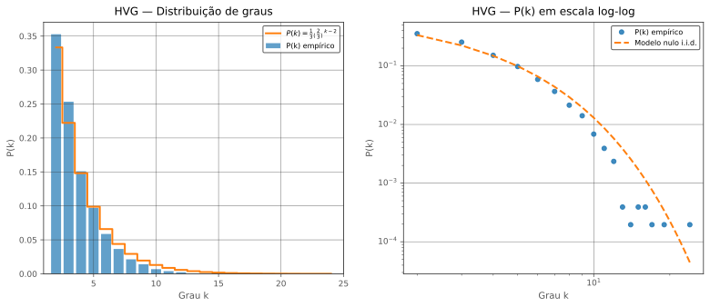
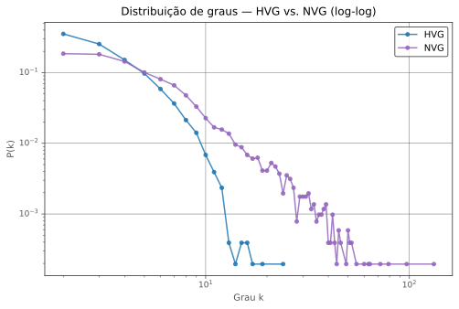
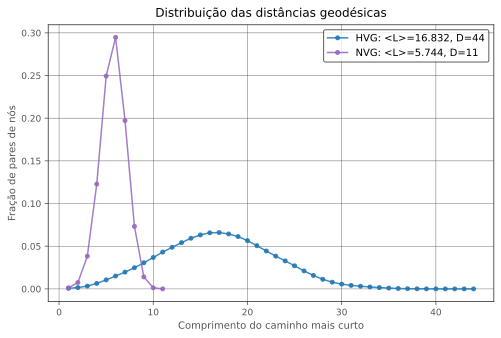

# Ondas de Calor e Grafos de Visibilidade — Fortaleza (INMET A304)

Trabalho computacional da disciplina de Redes Complexas (Mestrado em Modelagem e Métodos Quantitativos, UFC). A série de temperatura máxima diária da estação A304 (Fortaleza-CE) é convertida em dois grafos de visibilidade, o HVG (*Horizontal Visibility Graph*) e o NVG (*Natural Visibility Graph*). A estrutura das duas redes é medida e os maiores hubs do HVG são comparados com os eventos de onda de calor detectados na mesma série.

Notebook: [`ondas_de_calor_vg.ipynb`](ondas_de_calor_vg.ipynb) (Parte I: dados e construção das redes; Parte II: análise estrutural).

## Resultados

Rede construída sobre 5.114 dias (2008–2021):

| Métrica                  | HVG    | NVG     |
| ------------------------ | ------ | ------- |
| Nós (N)                  | 5.114  | 5.114   |
| Arestas (E)              | 9.287  | 16.862  |
| Densidade                | 0,00071 | 0,00129 |
| Componentes conexas      | 1      | 1       |
| Grau médio ⟨k⟩           | 3,632  | 6,594   |
| Grau máximo              | 24     | 132     |
| Agrupamento médio ⟨C⟩    | 0,542  | 0,740   |
| Transitividade           | 0,306  | 0,330   |
| Caminho mínimo médio ⟨L⟩ | 16,83  | 5,74    |
| Diâmetro (D)             | 44     | 11      |

- **HVG contra o modelo nulo i.i.d.** (Luque et al., 2009): o grau médio observado é 3,632, contra 4 no limite teórico. Para k = 2 a 13, a diferença entre P(k) empírico e P(k) teórico fica entre −0,008 e +0,031.
- **Cauda de P(k)** (ajuste log-log, k ≥ 5): HVG com α = 5,01 (R² = 0,914) e NVG com α = 2,42 (R² = 0,943).
- **Hubs e ondas de calor:** entre os 15 maiores hubs do HVG, 1 (6,7%) coincide com um dia de onda de calor (30/05/2010, CTX90pct). O maior hub é 26/11/2013 (32,2 °C, k = 24), um pico isolado que não pertence a nenhum dos dois catálogos de eventos.







## Dados

- **Fonte:** dados históricos horários do [portal do INMET](https://portal.inmet.gov.br/dadoshistoricos), estação A304, anos de 2003 a 2023.
- **Completude da temperatura máxima diária:** 92,18% (7.021 de 7.617 dias), com 20 blocos de falha listados em `data/processed/diagnostico_gaps_temp_max.csv`. Os anos de 2008 a 2013 e de 2015 a 2021 têm 100% de cobertura; 2014 tem 96,4%.
- **Recorte:** 2008–2021 (5.114 dias). Os 13 dias sem valor, da falha de dezembro de 2014, foram interpolados.

## Método

1. **Preparação:** padronização das colunas, conversão de valores inválidos (9999) em `NaN` e agregação das observações horárias em escala diária.
2. **Detecção de ondas de calor** (percentis de referência calculados em 2003–2017, duração mínima de 3 dias):
   - **CTX90pct:** temperatura máxima acima do percentil 90 do dia do ano (janela de ±15 dias). 59 eventos, duração média de 4,2 dias.
   - **EHF (*Excess Heat Factor*):** média de 3 dias da temperatura média menos o percentil 95 de referência (28,23 °C), multiplicada pelo termo de aclimatação. 66 eventos, duração média de 8,2 dias.
3. **Grafos de visibilidade:** `HorizontalVG` e `NaturalVG` da biblioteca [`ts2vg`](https://github.com/CarlosBergillos/ts2vg). Cada nó guarda a data, a temperatura máxima e as duas marcações de onda de calor.
4. **Validação do HVG** com a distribuição teórica de uma série i.i.d., P(k) = (1/3)(2/3)^(k−2).
5. **Análise estrutural** (HVG e NVG com as mesmas métricas): densidade, conectividade, distribuição de graus, transitividade, agrupamento local, distâncias geodésicas e diâmetro.
6. **Cruzamento físico-topológico:** os 15 maiores hubs do HVG são comparados com os catálogos CTX90pct e EHF. A coincidência é estrita: a data do nó precisa pertencer a um evento, sem tolerância de dias.

## Estrutura do repositório

```
.
├── ondas_de_calor_vg.ipynb      # notebook completo (Partes I e II)
├── requirements.txt
├── data/
│   ├── processed/
│   │   ├── fortaleza_horario.parquet
│   │   ├── fortaleza_diario.parquet
│   │   ├── fortaleza_ondas_detectadas.parquet
│   │   ├── diagnostico_gaps_temp_max.csv
│   │   ├── eventos_ctx90pct.csv
│   │   ├── eventos_ehf.csv
│   │   ├── hvg_temp_max_2008_2021.graphml
│   │   └── nvg_temp_max_2008_2021.graphml
│   └── plots/                   # figuras geradas pelo notebook (SVG)
└── README.md
```

## Como executar

Requer Python 3.10 ou superior.

```bash
git clone https://github.com/hellnM/Ondas-de-Calor-e-VG.git
cd Ondas-de-Calor-e-VG
python -m venv .venv
source .venv/bin/activate      # Windows: .venv\Scripts\activate
pip install -r requirements.txt
jupyter notebook ondas_de_calor_vg.ipynb
```

Execute as células em ordem. O notebook usa os caminhos relativos `data/processed` e `data/plots`, por isso deve ser aberto a partir da raiz do repositório.

Os dados já processados estão em `data/processed/`. Enquanto `fortaleza_horario.parquet` e `fortaleza_diario.parquet` existirem, o notebook os carrega e não baixa nada. Para refazer a coleta a partir do INMET, apague esses dois arquivos: o notebook baixa os 21 arquivos anuais (2003–2023) e grava os CSVs brutos em `data/raw/`, que não é versionada.

## Limitações

- Uma estação (A304) e uma variável (temperatura máxima diária).
- O cruzamento entre hubs e ondas de calor usa coincidência estrita de data, sem teste estatístico contra o acaso. Com 1 coincidência em 15, o resultado não indica que o grau no HVG funcione como detector de ondas de calor.
- O modelo nulo existe apenas para o HVG (distribuição teórica i.i.d.). O NVG não tem modelo nulo, e não há séries substitutas (*surrogates*).
- O grau médio observado no HVG (3,632) fica abaixo do valor teórico (4); o notebook não investiga a causa.
- O ajuste da cauda usa k ≥ 5 e apenas o R² como medida de qualidade. No HVG a faixa é curta (k máximo = 24).
- Os percentis de referência (2003–2017) se sobrepõem ao recorte da rede (2008–2021).
- Os anos de 2022 e 2023 têm cobertura de 89,6% e 75,1% e ficam fora do recorte.
- Os CSVs brutos do INMET não estão no repositório. Refazer a coleta depende do formato de URL atual do portal do INMET.

## Referências

- Lacasa, L. et al. *From time series to complex networks: The visibility graph.* PNAS 105(13), 2008.
- Luque, B. et al. *Horizontal visibility graphs: Exact results for random time series.* Physical Review E 80, 046103, 2009.

## Autoria

Hellen de Andrade Moura — Mestrado em Modelagem e Métodos Quantitativos, UFC.
